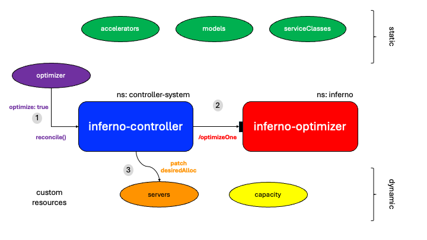
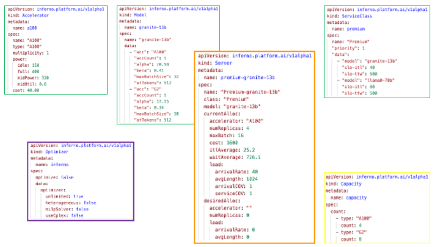

# Inferno Controller

A Kubernetes runtime controller for the [Inferno Optimizer](https://github.com/llm-inferno/inferno).

## Description

This controller defines the following custom resources and performs reconciliation by invoking REST API calls on the [Inferno Optimizer Server](https://github.com/llm-inferno/inferno/tree/main/rest-server).
The decisions made by the Optimizer are reflected in the `desiredAllocation` specifications of the inference servers.





### Custom resources

- Accelerator: Static data about accelerators

```yaml
apiVersion: inferno.platform.ai/v1alpha1
kind: Accelerator
metadata:
  name: a100
spec:
  name: "A100"
  type: "A100"
  multiplicity: 1
  power:
    idle: 150
    full: 400
    midPower: 320
    midUtil: 0.6
  cost: 40.00
```

- Model: Static data about models and their performance characteristics

```yaml
apiVersion: inferno.platform.ai/v1alpha1
kind: Model
metadata:
  name: granite-13b
spec:
  name: "granite-13b"
  data:
    - "acc": "A100"
      "accCount": 1
      "alpha": 20.58
      "beta": 0.41
      "maxBatchSize": 32
      "atTokens": 512
    - "acc": "G2"
      "accCount": 1
      "alpha": 17.15
      "beta": 0.34
      "maxBatchSize": 38
      "atTokens": 512
```

- ServiceClass: Static data about service classes

```yaml
apiVersion: inferno.platform.ai/v1alpha1
kind: ServiceClass
metadata:
  name: premium
spec:
  name: "Premium"
  "priority": 1
  "data":
    - "model": "granite-13b"
      "slo-itl": 40
      "slo-ttw": 500
    - "model": "llama0-70b"
      "slo-itl": 80
      "slo-ttw": 500
```

- Server: Data about inference servers, including current and desired allocation

``` yaml
apiVersion: inferno.platform.ai/v1alpha1
kind: Server
metadata:
  name: premium-granite-13b
spec:
  name: "Premium-granite-13b"
  class: "Premium"
  model: "granite-13b"
  currentAlloc:
    accelerator: "A100"
    numReplicas: 4
    maxBatch: 16
    cost: 160
    itlAverage: 25.2
    waitAverage: 726.5
    load:
      arrivalRate: 40
      avgLength: 1024
      arrivalCOV: 1
      serviceCOV: 1
  desiredAlloc:
    accelerator: "G2"
    numReplicas: 6
    maxBatch: 20
    cost: 125
    itlAverage: 20.5
    waitAverage: 100.0
    load:
      arrivalRate: 40
      avgLength: 1024
```

- Capacity: Dynamic available accelerator types in the cluster

```yaml
apiVersion: inferno.platform.ai/v1alpha1
kind: Capacity
metadata:
  name: capacity
spec:
  count:
    - type: "A100"
      count: 4
    - type: "G2"
      count: 8
```

- Optimizer: Request to optimize, along with optimization parameters

```yaml
apiVersion: inferno.platform.ai/v1alpha1
kind: Optimizer
metadata:
  name: inferno
spec:
  optimize: false
  data:
    optimizer:
      unlimited: true
      heterogeneous: false
      milpSolver: false
      useCplex: false
```

### Operation

The controller works in one of two modes: Statefull and Stateless (default), through setting the `INFERNO_STATELESS` boolean environment variable.

- In Statefull mode, the Optimizer keeps an up-to-date state (data about all custom resources) so that when optimization is performed, the data is readily available, at the expense of risking the Optimizer failing.
- Whereas, in the Stateless mode, all data is maintained by the API Server and the Optimizer reacts only to an optimization request. Only at that time that all data is obtained through the API Server.

## Getting Started

### Prerequisites

- go version v1.23.0+
- docker version 17.03+.
- kubectl version v1.11.3+.
- Access to a Kubernetes v1.11.3+ cluster.

### To Deploy on the cluster

**Build and push your image to the location specified by `IMG`:**

```sh
make docker-build docker-push IMG=<some-registry>/controller:tag
```

**NOTE:** This image ought to be published in the personal registry you specified.
And it is required to have access to pull the image from the working environment.
Make sure you have the proper permission to the registry if the above commands don’t work.

**Install the CRDs into the cluster:**

```sh
make install
```

**Deploy the Manager to the cluster with the image specified by `IMG`:**

> **NOTE**: The `make deploy` command creates a yaml file which is applied in the cluster. In order for the Controller to use the Optimizer, some environment variables need to be set. This is done by adding the following to the Deployment specifications in the resulting yaml file. It is assumed that the Optimizer is already deployed in the cluster as a REST API server.

```yaml
env:
  - name: INFERNO_HOST
    value: "inferno-optimizer.inferno.svc.cluster.local"
  - name: INFERNO_PORT
    value: "80"
```

```sh
make deploy IMG=<some-registry>/controller:tag
```

> **NOTE**: If you encounter RBAC errors, you may need to grant yourself cluster-admin
privileges or be logged in as admin.

For testing, a deploy.yaml file is already created.

```sh
kubectl apply -f manifests/yamls/deploy.yaml
```

**Create instances of your solution**
You can apply the samples (examples) from the manifests/yamls:

```sh
kubectl apply -k manifests/yamls/
```

### To Uninstall

**Delete the instances (CRs) from the cluster:**

```sh
kubectl delete -k manifests/yamls/
```

**Delete the APIs(CRDs) from the cluster:**

```sh
make uninstall
```

**UnDeploy the controller from the cluster:**

```sh
kubectl delete -f manifests/yamls/deploy.yaml
```

## Project Distribution

Following the options to release and provide this solution to the users.

### By providing a bundle with all YAML files

1. Build the installer for the image built and published in the registry:

```sh
make build-installer IMG=<some-registry>/controller:tag
```

**NOTE:** The makefile target mentioned above generates an 'install.yaml'
file in the dist directory. This file contains all the resources built
with Kustomize, which are necessary to install this project without its
dependencies.

1. Using the installer

Users can just run 'kubectl apply -f \<URL for YAML BUNDLE\>' to install
the project, i.e.:

```sh
kubectl apply -f https://raw.githubusercontent.com/<org>/controller/<tag or branch>/dist/install.yaml
```

### By providing a Helm Chart

1. Build the chart using the optional helm plugin

```sh
kubebuilder edit --plugins=helm/v1-alpha
```

1. See that a chart was generated under 'dist/chart', and users
can obtain this solution from there.

**NOTE:** If you change the project, you need to update the Helm Chart
using the same command above to sync the latest changes. Furthermore,
if you create webhooks, you need to use the above command with
the '--force' flag and manually ensure that any custom configuration
previously added to 'dist/chart/values.yaml' or 'dist/chart/manager/manager.yaml'
is manually re-applied afterwards.

## Contributing

**NOTE:** Run `make help` for more information on all potential `make` targets

More information can be found via the [Kubebuilder Documentation](https://book.kubebuilder.io/introduction.html)

## License

Copyright 2025.

Licensed under the Apache License, Version 2.0 (the "License");
you may not use this file except in compliance with the License.
You may obtain a copy of the License at

```sh
http://www.apache.org/licenses/LICENSE-2.0
```

Unless required by applicable law or agreed to in writing, software
distributed under the License is distributed on an "AS IS" BASIS,
WITHOUT WARRANTIES OR CONDITIONS OF ANY KIND, either express or implied.
See the License for the specific language governing permissions and
limitations under the License.
